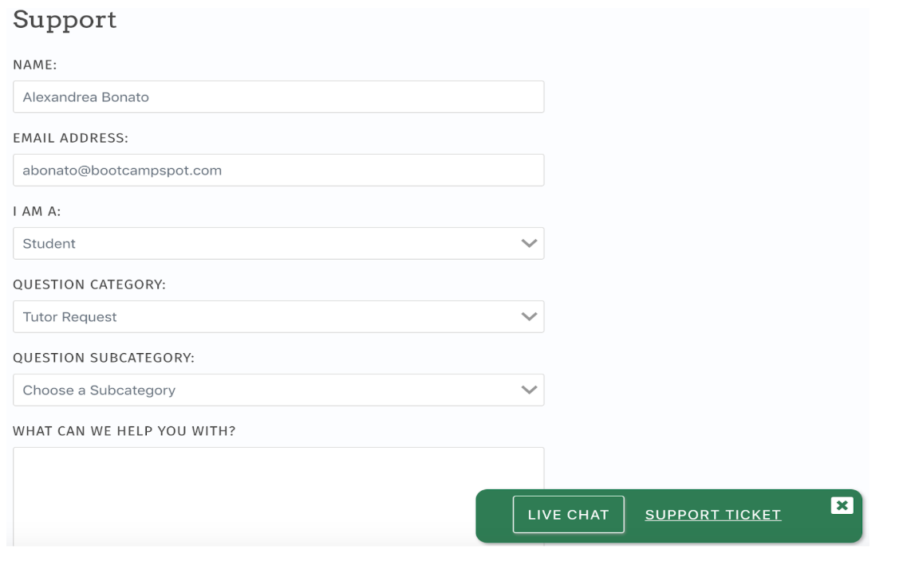

## Student Support
[Back to Course Guidelines](README.md)

1. [Class Videos](#class-videos)
2. [Tutoring](#tutoring-details)
3. [Office Hours](#office-hours)
4. [Learning Assistant Support](#learning-assistant-support)          
5. [Important Links And Notes](#important-links-and-notes)
6. [Course Content Overview](#course-content-overview) 
7. [Technical Curriculum by Week](#technical-curriculum-by-week)   

<hr>

#### Class Videos
[Back to top](#student-support)

Supplemental videos will be made available after lessons to help support your learning.
Class Videos will be posted in the `#class-videos` slack chanel. 


#### Tutoring
[Back to top](#student-support)

Tutoring Sessions will be made available to you if needed.

These sessions require that you have turned in homework and are in good standing with your attendance.

**How the system works:**

1) If you are interested in tutoring, you can find a chat window within BootcampSpot to request a tutor. You must also meet the attendance and homework requirements ( No more than 4 missed classes and no more than 2 missed homework assignments)

2) Once you have communicated your desire for a tutor through BootcampSpot the Student will receive an email with their assigned tutor 24-48 hours.Student will need to schedule their first session 24-48 hours after receiving email. 

Steps: 

**Step ONE** Log into BCS, on the main page click the support button on the nav bar.

 <div style="text-align:center"></div>

**Step TWO** From the drop down choose “I am a student” and “Tutor Request”. In the text box include topics you’d like support with along with your Github username. 

  <div style="text-align:center"></div>

**Step THREE** You will receive an email from Central Supports within 24-48 hours connecting you to your assigned tutor!


#### Tutoring Details
[Back to top](#student-support)

**Keep in mind any time zone differences. Please make sure to discuss it with your tutor.  This issue has created a few missed sessions in the past.**

**Sessions should be 60 minutes in length. Twice a week via a video using google hangouts.**

4) At the end of each session discuss scheduling the next session.  

5) Both the tutor and the student are **required** to fill out an evaluation form after EACH session.  Data is very important to the ongoing success of Central Support.  **Every tutor assignment email has the link to the Student’s Evaluation Form.**

* **If a student No-Shows to a session, the student may not be eligible for tutoring in the future.**

* **If student needs to change the appointment communicate with your tutor immediately.**

<hr>

####  Office Hours
[Back to top](#student-support)

Live Office Hours:

Every Class Day 45 minutes before class and 30 minutes after class to review course material

* Reviewing Code Drills
* Reviewing previously introduced material

> 1:1 sessions and Specific Technical errors should be attended to using your *tutoring* and *AskBCS Support* systems or limited 1:1 Sessions with a TA. 

 

#### Morning Office Hours

1. TA will reside a breakout room intended for Review. 
2. The main room is a general Study area.
3. Message in the #morning-review or your Zero channel if you wish to join a review for the morning. Feel Free to list a topic you wish to review. 


#### Afternoon Office Hours

1. TA will reside a breakout room intended for 1:1 Support. 
2. The main room is a general Study area.
3. You are able to book time with the TA Via the following link: [Mahisha Reservation Link](https://calendly.com/mahisha/mahisha-one-to-one-availability-link)
4. Each student can reserve 15 minutes. 
5. When it is your reserved time you will moved to join [Mahisha Reservation Link](https://calendly.com/mahisha/mahisha-one-to-one-availability-link) in his breakout room. 
6. And when your time is up you will be moved to your team breakout room. 
7. Instructor will be meeting with be scheduling 1:1 with students as the course progresses. 


*Afternoon 1:1 Office Hours are intended to get you unstuck*  


> 1:1 sessions and Specific Technical errors should be attended to using your *tutoring* and *AskBCS Support* systems or limited 1:1 Sessions with a TA. 

Reserve a 15 minute Afternoon One-to-One session with the TA:


#### Project Office Hours

1. Once a you arrive to class in the morning you will be moved into your Team Breakout room during Project Time

<hr>

####  AskBCS Support

##### Hours of LA Support (local time)

```
10a - 12a - Monday - Thursday 
10a - 10p - Friday - Sunday
```

##### Learning Assistant Service Expectations

> Learning Assistants strive to provide a path forward for students in under 30 minutes. Response and resolution times will vary, as service demands fluctuate throughout the day.
Students should only ask questions when they have the time to dedicate to working with an LA. 

> If a student goes unresponsive for 30 minutes, their question will be automatically closed. The student will need to ask their question again, entering at the back of the queue.

##### How to Use AskBCS

*Step 1 - Login to Slack*

> Log in to your cohort's Slack Workspace. In the left sidebar, you will see a dropdown labeled​ `Apps.` Click the sidebar and select ​AskBCS Learning Assistant

*Step 2 - Home Screen Navigation*

> You are now at the Homescreen. Here you can ask a new question, view your open, and previously asked questions. To submit a new question, click the ​`Ask a Question ?` ​button on the top of the screen

*Step 3 - Question Form*

> Clicking the ​`Ask a Question ?`​ button will trigger a pop-up to open. Here you can write out your question. Please provide as much detail as possible.​ (If you need to add additional information, you will be able to later)


*Step 4 - Submit Your Question*

> Click ​`Submit,`​ your question will be submitted to the Learning Assistants’ queue. A new private channel will be created in the left sidebar of your cohort’s workspace. This newly created private channel is where you will communicate with the LA, once they claim your question. This will allow you to chat privately with the learning assistant. Your conversation will not be visible to other students.

*Step 5 - Navigate to the Conversation*

> Navigate to the newly created private channel. You can navigate there by clicking on the channel in the left sidebar​ or the ​`View Question`​ Button under the ​`My Open Questions’ ​section`.

*Step 6 - Add additional Information*

> Navigate to the newly created private channel. Here you can add supplemental information for your question. You can include attachments, screenshots, and use rich-text formatting as well.

*Step 7 - LA Support*

> Once claimed, you will be greeted by an LA who will work with you to clarify misunderstandings and help you find the answer to your question. You can communicate back and forth with the LA.

*Step 8 - Resolution*

> Once the question has been answered, the LA will close the question. You will be prompted to give feedback on the LA’s service. After your question is closed, you will no longer be able to communicate with the LA.

*(Optional) Step 10 - Ask Another Question*

> If you have another question, navigate back to the home tab and submit a new question. Your most recent question will be added to your ​`My Latest Resolved Questions`​ section.


*(Optional) Step 9 - Feedback*

> After providing feedback on the LA’s service, you can provide additional feedback about the rating you chose.

See PDF Documentation (here)[/assests/pdf/AskBCS Guide - Student Guide.pdf]

##### Conceptual 

"What is the difference between HTML 4 and 5? Is it important to understand HTML 4 nowadays?"
Homework-Related 

"When the instructions say, "Do this/that thing", I am confused on how I might start that? I have started the assignment, here's what I have so far. Ideas for how to move forward?"

##### Activity or Lesson-Related 

"In class today, we completed the X-activity, and I messed up on creating an object. I tried to do Y-thing, and I'm not sure how to make it work. Here's a snippet of my code."
Troubleshooting  

"My code keeps throwing this error and I don't know why? [ insert snippet of code ] [ insert error message]"

##### General 

"I've been trying to practice more of X thing, and I would love to see an example of how this works. Could you support me in sharing one?"


Asking the right questions 

> Asking the right type of question is key to becoming a developer. It’s a skill you will utilize every day in all aspects of the job. Asking great questions will not only clarify misunderstandings, it will also allow the Learning Assistants to address additional issues or provide additional resources to you.

Great Questions  

>Great questions provide 3 points for the Learning Assistants to address, What, Why, and How.

```
What is my question?
Why am I asking this question?
How do I implement this concept/idea?
```

<hr>

## Important Links And Notes
[Back to top](#student-support)

Slack
> Used for communication, collaboration, and exploration


[BootcampSpot / Homework](https://bootcampspot.com/)
> Used for class attendance (CHECK-IN), Homework & Project Submissions, Course Outline

[Pre-Work](https://coding-bootcamp-fsf-prework.readthedocs-hosted.com/en/latest/)

> Please [click here](https://coding-bootcamp-fsf-prework.readthedocs-hosted.com/en/latest/) to access the pre-work.

>**Due on the first day of class**

<hr>

## Course Content Overview
[Back to top](#student-support)

The **`Course Content`** listing will lead you to specific sections of the course. Each secion will contain:

*  an `activites Directory`

> These are activities for classtime lab.

* `Student Resources`

> This is a listing of Students Resources: links, terminology, install instructions, etc.

*  `Homework Descriptions`

> This is a listing for Homework description with Detailed Instructions.

*  `Code Drills`

> Additional Coding Drills to be done outside of class. These drills intend to reinforce, build on, expland, or review core classroom content.


These directories will be released week by week, day by day, as we progress through the course and will provide you with an optimal `scope` and `sequence` on your path developing your skill working with `Data`.

<hr>

## Technical Curriculum by Week
[Back to top](#student-support)

Please see [bootcampspot.com](https://bootcampspot.com/)

For a unit overview of the entire course see [Unit Overview](unit-overview/README.md)

##### The material covered in this syllabus is subject to change. Our academic team adjusts to the market rapidly.
